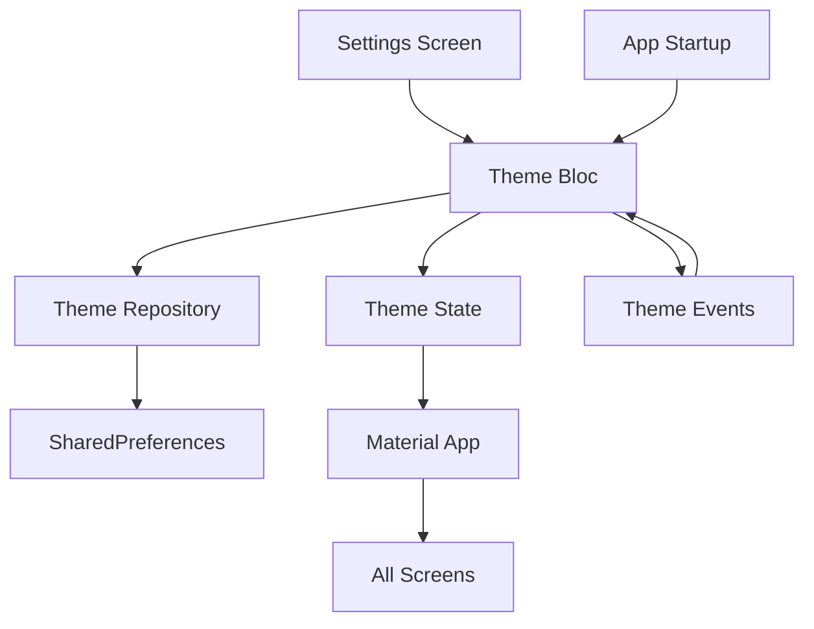

# Design Document

## Overview

Дизайн системы переключения темы для Flutter приложения Crypto Trading Lessons с использованием BLoC паттерна и SharedPreferences для персистентного хранения пользовательских предпочтений.

## Architecture

### Component Diagram



### Layer Responsibilities

- **Presentation Layer**: Settings UI с переключателем темы
- **Business Logic Layer**: Theme BLoC для управления состоянием
- **Data Layer**: Theme Repository для работы с SharedPreferences

## Components and Interfaces

### 1. Theme BLoC

```dart
// Theme Events
abstract class ThemeEvent {}
class ThemeChanged extends ThemeEvent {
  final ThemeMode themeMode;
  ThemeChanged(this.themeMode);
}
class ThemeLoaded extends ThemeEvent {}

// Theme States  
abstract class ThemeState {}
class ThemeInitial extends ThemeState {}
class ThemeLoadInProgress extends ThemeState {}
class ThemeLoadSuccess extends ThemeState {
  final ThemeMode themeMode;
  ThemeLoadSuccess(this.themeMode);
}
class ThemeLoadFailure extends ThemeState {
  final String error;
  ThemeLoadFailure(this.error);
}

// Theme BLoC
class ThemeBloc extends Bloc<ThemeEvent, ThemeState> {
  final ThemeRepository _themeRepository;
  
  ThemeBloc(this._themeRepository) : super(ThemeInitial()) {
    on<ThemeLoaded>(_onThemeLoaded);
    on<ThemeChanged>(_onThemeChanged);
  }
}
```

### 2. Theme Repository

```dart
abstract class ThemeRepository {
  Future<ThemeMode> getThemeMode();
  Future<void> setThemeMode(ThemeMode themeMode);
}

class ThemeRepositoryImpl implements ThemeRepository {
  final SharedPreferences _prefs;
  static const String _themeKey = 'theme_mode';
  
  ThemeRepositoryImpl(this._prefs);
}
```

### 3. Settings UI Integration

```dart
class ThemeSettingsTile extends StatelessWidget {
  Widget build(BuildContext context) {
    return BlocBuilder<ThemeBloc, ThemeState>(
      builder: (context, state) {
        // Render theme selector
      },
    );
  }
}
```

## Data Models

### Theme Mode Enum Extension

```dart
extension ThemeModeExtension on ThemeMode {
  String get displayName {
    switch (this) {
      case ThemeMode.light:
        return 'Light';
      case ThemeMode.dark:
        return 'Dark';
      case ThemeMode.system:
        return 'System';
    }
  }
  
  String get storageValue {
    switch (this) {
      case ThemeMode.light:
        return 'light';
      case ThemeMode.dark:
        return 'dark';
      case ThemeMode.system:
        return 'system';
    }
  }
  
  static ThemeMode fromString(String value) {
    switch (value) {
      case 'light':
        return ThemeMode.light;
      case 'dark':
        return ThemeMode.dark;
      case 'system':
      default:
        return ThemeMode.system;
    }
  }
}
```

## Correctness Properties

*A property is a characteristic or behavior that should hold true across all valid executions of a system-essentially, a formal statement about what the system should do. Properties serve as the bridge between human-readable specifications and machine-verifiable correctness guarantees.*

### Property 1: Theme Persistence Round Trip
*For any* valid ThemeMode value, saving it to the repository and then loading it should return the same ThemeMode value
**Validates: Requirements 2.1, 2.2**

### Property 2: BLoC State Emission
*For any* ThemeChanged event sent to Theme_Bloc, the bloc should emit a ThemeLoadSuccess state with the corresponding ThemeMode
**Validates: Requirements 1.2, 4.3**

### Property 3: Theme Mode Support
*For any* of the three ThemeMode values (light, dark, system), the Theme_Bloc should handle the mode correctly and emit appropriate state
**Validates: Requirements 1.4**

### Property 4: Error Handling Gracefully
*For any* SharedPreferences operation that throws an exception, the Theme_Repository should catch the error and continue functioning without crashing
**Validates: Requirements 2.4, 2.5**

### Property 5: UI State Synchronization
*For any* ThemeState emitted by Theme_Bloc, the UI components should reflect the current theme mode accurately
**Validates: Requirements 3.1, 3.3**

### Property 6: Repository Dependency Usage
*For any* theme persistence operation in Theme_Bloc, the bloc should delegate to Theme_Repository methods
**Validates: Requirements 4.4**

### Property 7: Theme Application Consistency
*For any* theme change, the application should use the existing AppThemes.lightTheme or AppThemes.darkTheme without modification
**Validates: Requirements 5.1**

### Property 8: Reactive UI Updates
*For any* theme change, all screens in the application should update their appearance without requiring app restart
**Validates: Requirements 5.3**

## Error Handling

### Repository Error Handling
- **SharedPreferences Failures**: Log error, return default system theme
- **Serialization Errors**: Log error, fallback to system theme
- **Permission Errors**: Log error, continue with in-memory state

### BLoC Error Handling
- **Repository Failures**: Emit ThemeLoadFailure state with error message
- **Invalid Events**: Log warning, ignore invalid events
- **State Corruption**: Reset to initial state with system theme

### UI Error Handling
- **BLoC Connection Failures**: Show system theme as fallback
- **State Rendering Errors**: Display error message, allow retry
- **Animation Failures**: Skip animations, apply theme immediately

## Testing Strategy

### Unit Testing
- **Theme Repository**: Test SharedPreferences operations with mocked dependencies
- **Theme BLoC**: Test event handling and state emission with mocked repository
- **Theme Extensions**: Test string conversion and enum mapping functions
- **Error Scenarios**: Test error handling with mocked failures

### Widget Testing
- **Theme Settings Tile**: Test UI rendering with different theme states
- **Theme Selection Dialog**: Test user interaction and event dispatching
- **BLoC Integration**: Test widget updates when BLoC state changes

### Property-Based Testing
- **Persistence Round Trip**: Test save/load operations with random ThemeMode values (minimum 100 iterations)
- **BLoC Event Processing**: Test event handling with random valid events (minimum 100 iterations)
- **Error Recovery**: Test error handling with random exception scenarios (minimum 100 iterations)

Each property test must reference its design document property and run minimum 100 iterations due to randomization. Tag format: **Feature: theme-switcher, Property {number}: {property_text}**